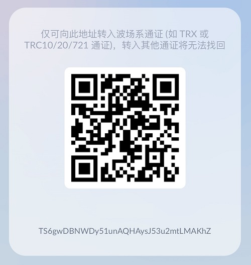

<p align="center"></p>

<p align="center">
<a href="https://www.gnu.org/licenses/gpl-3.0.html"></a>
<a href="https://www.php.net/releases/7_4_0.php"></a>
<a href="https://github.com/assimon/dujiaoka/releases/tag/1.0.0"></a>
<a href="https://t.me/CoinConvertChannel"></a>
<a href="https://t.me/CoinConvertBot"></a>
</p>

## 兑币机 - Telegram Bot

>一款开源自动化USDT兑换TRX的Telegram机器人！

## AD -- Telegram机器人推广
查币机 - 链上信息查询：[查币机](https://t.me/QueryCoinBot)
> 支持TRON、ETH、Polygon、BSC多链资产查询，也支持多种法币与区块链货币的实时汇率查询。

USDT、TRX交易监控机器人：[USDT、TRX交易监控](https://t.me/CoinListenBot)
> 监控波场地址余额变化，速度比钱包App的推送更快！！！

兑币机 - TRX自动兑换：[兑币机](https://t.me/CoinConvertBot)
> 自用兑币机，并不是开源版机器人！！！

波场能量机器人：[波场能量机器人](https://t.me/Buy_Energy_Bot)
> 波场能量租用，有能量时转账USDT不扣TRX，为你节省50-70%的TRX

TG会员秒开机器人：[TG会员秒开-全自动发货](https://t.me/BuyYourPremiumBot)
> 24小时自动开通Telegram Premium会员，只需一个用户名即可开通。

+888匿名号码租用机器人：[+888匿名号码租用机器人](https://t.me/Zu888Bot)
> Telegram +888 匿名号码租用机器人。

客服爸爸机器人：[客服爸爸](https://t.me/KeFuFatherBot)
> 免费创建您自己的客服机器人（双向机器人）。

## 项目简介
- `CoinConvertBot`是一个由`C#语言`编写的私有化部署`USDT-TRC20`全自动兑换`TRX`的机器人。     
- 本项目不依赖任何外部资源，无需另外部署`数据库`，采用轻量化的`sqlite`，也无需`redis`。
- 可实现`USDT-TRC20`入账指定地址，自动向转账地址回款`TRX`，全程无需人工干预！😊 😊 😊
- 私有化搭建使得您的私钥🔑安全无比，同时USDT代币直接进入您的钱包💰
- `CoinConvertBot` 遵守 [GPLv3](https://www.gnu.org/licenses/gpl-3.0.html) 开源协议!

## 项目特点
- 支持私有化部署，无需担心钱包被盗😁
- `C#语言`跨平台实现，支持x86和arm芯片架构的win/linux/mac设备
- 支持配置多个入账钱包地址，提高资金安全性
- 无需额外环境配置，仅运行一个编译后二进制文件即可使用
- `Telegram`大平台，更多客户，更便捷的使用和快速通知

## 项目结构
```
CoinConvertBot
    ├── src ---> (项目核心目录）
    └── wiki ---> (知识库)
```

## 教程（待完善）：
- 宝塔运行`CoinConvertBot`教程👉🏻[宝塔运行CoinConvertBot](wiki/BT_RUN.md)
- 手动运行`CoinConvertBot`教程👉🏻[手动运行CoinConvertBot](wiki/manual_RUN.md)


## 加入交流/意见反馈
- `CoinConvertBot`频道[https://t.me/CoinConvertChannel](https://t.me/CoinConvertChannel)
- `CoinConvertBot`交流群组[https://t.me/CoinConvertChat](https://t.me/CoinConvertChat)

## 设计实现
`CoinConvertBot`的实现方式与其他项目原理类似，都是通过监听`TRC20`网络的api或节点，      
监听钱包地址`USDT`代币入账事件，将入账金额，根据汇率，扣除手续费后，转换为`TRX`
```
简单的原理：
0.服务器定时同步交易所最新汇率
1.客户支付20.05 USDT，交易上链
2.服务器定时通过API轮询，获取监听地址下的最新USDT入账交易，并记录到数据库，标记为待处理
3.定时任务读取数据库待处理的入账记录，读取数据库最新汇率，将USDT金额按照汇率转换为TRX金额
4.使用配置的钱包转此金额的TRX到转出USDT的地址
5.交易成功后通知客户(需要客户已经在机器人处绑定钱包地址)和管理员
```

## 打赏
如果该项目对您有所帮助，希望可以请我喝一杯咖啡☕️
```
USDT-TRC20打赏地址: TKGTx4pCKiKQbk8evXHTborfZn754TGViP
```


## 致谢
感谢以下开源项目：

[Serilog](https://github.com/serilog/serilog) 

[FreeSql](https://github.com/dotnetcore/FreeSql) 

[Flurl](https://github.com/tmenier/Flurl) 

[Telegram.Bot](https://github.com/TelegramBots/Telegram.Bot) 

[TronNet](https://github.com/stoway/TronNet) 

## 声明
`CoinConvertBot`为开源的产品，仅用于学习交流使用！       
不可用于任何违反中华人民共和国(含台湾省)或使用者所在地区法律法规的用途。           
因为作者即本人仅完成代码的开发和开源活动(开源即任何人都可以下载使用或修改分发)，从未参与用户的任何运营和盈利活动。       
且不知晓用户后续将程序源代码用于何种用途，故用户使用过程中所带来的任何法律责任即由用户自己承担。            
```
！！！Warning！！！
项目中所涉及区块链代币均为学习用途，作者并不赞成区块链所繁衍出代币的金融属性
亦不鼓励和支持任何"挖矿"，"炒币"，"虚拟币ICO"等非法行为
虚拟币市场行为不受监管要求和控制，投资交易需谨慎，仅供学习区块链知识
```
[](https://starchart.cc/LightCountry/CoinConvertBot)
